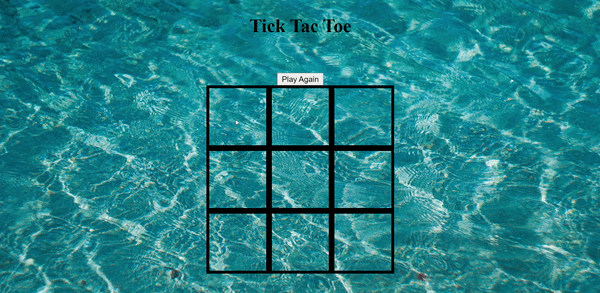

<h1 align="center">Fish Tac Toe| <a href="https://g-roid.github.io/fish-tac-toe/">Visit here!</a></h1>

  

<h3 align="center">tic tac toe with a twist</h3>
 
 

## How It's Made:
**Tech used:** HTML, CSS, and JavaScript
Project which focuses on separations of concerns. The HTML, CSS and JS are contain within individual files to ensure the game is maintainable. Initially, the smaller component objects were tested individually and then combined into a single Game object. Lastly, the game was linked to a UI by including event listeners onto each grid element.

<h2 align="center">Techs used:</h2>
 

	
	&nbsp&nbsp&nbsp
	
	&nbsp&nbsp&nbsp
	

 

## Optimizations
The game could be optimized by including a timer feature. If a player turn exceeds a specific amount time, a default move could be played. Addionally, the game state could be saved by using local storage. 

## Lessons Learned:
This project allowed me put into practice the four pillars of OOP. Each class was encapsulated and the overall game problem was abstracted into smaller classes. The tic tac toe game featured the following core classes. 
* Game class
* WinCheck class
* grid class

